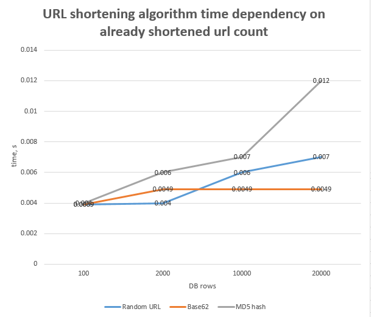
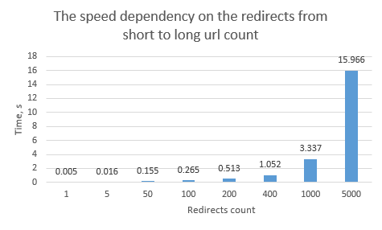

# URL shortener for Vilantis

# Installation

# Considered url generation implementation ways:
1. **Short URL from random leters and numbers.**
   Just making a random choice for each character and checking if this short url exists in DB or not. If it doesn‘t exist return the short url else generate another url.

    **The problem**: as more and more short url are generated, generated url starts repeat and system needs to regenerate it.
2. Also considered an option to use incremental counter.
    It would help to prevend the issue of collision. But then it would be easy to identify which of the two given short URLs was generated earlier, so this solution was rejected immediately.
3. **Base conversion (URL encoding through base62)**
    I used the id stored in the database and converted it base 62 number. Each 62 number matches a character or a digit.

    **Noticed problems:**
    - This algorithm generates strings of different lengths, so it needs to be modified (I choose to insert 0 until the short URL is the right length)
    - If the letters are sorted alphabetically, it is quite easy to guess which url was generated earlier.
4. **MD5 hashing algorithm.**
    Firstly long URL is encoded by this algorithm, then we take first 8 characters of it.
    Although The first 8 chacacters can be the same for different long URLs, so we need to check the DB to verify that shorten url is not used already. If it is already used, system tries next 8 characters of the same hashed value and continue until unique value is found.
	**Noticed problem:** the more I try to shorten the same long URL, the longer it gets.
    So I decided to modify this algorithm and before hashing use the second approach (use incremental counter), concat it with long url and then hash it with md5. Then I entered the same long_url and result I got is x2 faster than before.

## I made a chart to compare these implementations speed

## A benchmark to showcase the speed of redirecting from short to long URLs

# Requirements
**Required**

- [x] On the main page of the service, provide a web interface by which a user can shorten a URL;
- [x] If a user visits the short URL, they must receive a temporary HTTP redirect to the long URL;
- [x] Attempt to optimize the speed at which the URL is resolved to the best of your ability;
- [x] All the short URLs must be reasonably short and of the same length;
- [x] Given a short URL, it must be impossible to identify the long URL, when the short URL was generated, or which user generated it, or any other metadata in any other way than via the service API;
- [x] It must be impossible to easily identify which of the two given short URLs was generated earlier;
- [x] If the same long URL is shortened the second time, it must produce a different short URL;
- [x] Provide a Readme file with instructions on how to run the service;
- [x] Provide tests covering the core functionality;

**Optional**
- [x] Provide an admin interface for the user which allows to deactivate or permanently delete any of the URLs they have shortened;
- [x] Record the click statistics for each short URLs that the user has created and display it in the admin interface: time; IP address; HTTP Referer;
- [x] Expiration time: automatically deactivate the URL at a given time (configured per URL in the admin interface);
- [x] Limit maximum number of clicks on URL: automatically deactivate the URL after the limit is reached;
- [ ] Allow to run the service with docker-compose up command;
- [x] Provide a benchmark to showcase the speed of redirecting from short to long URLs.

